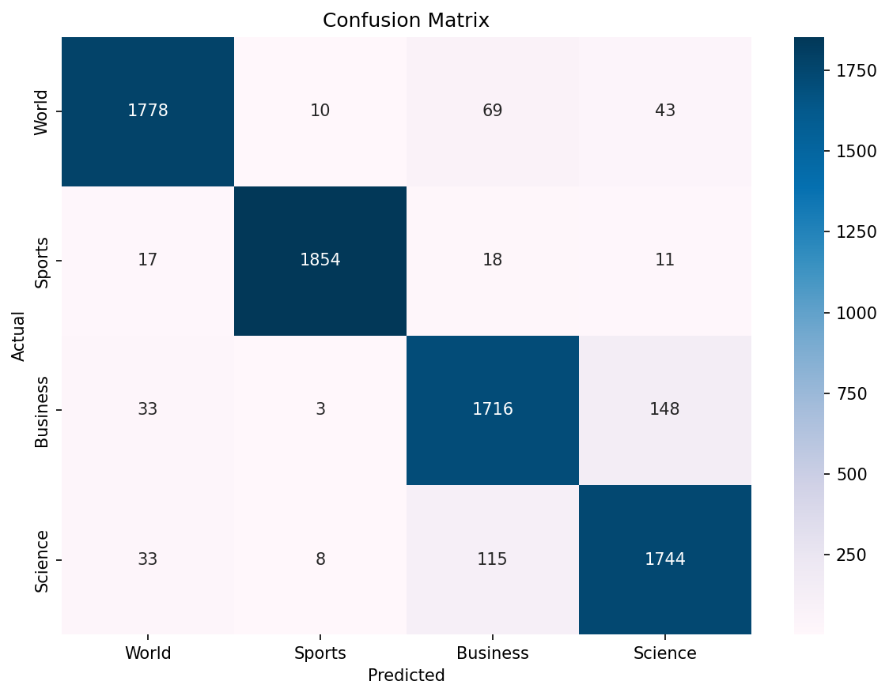
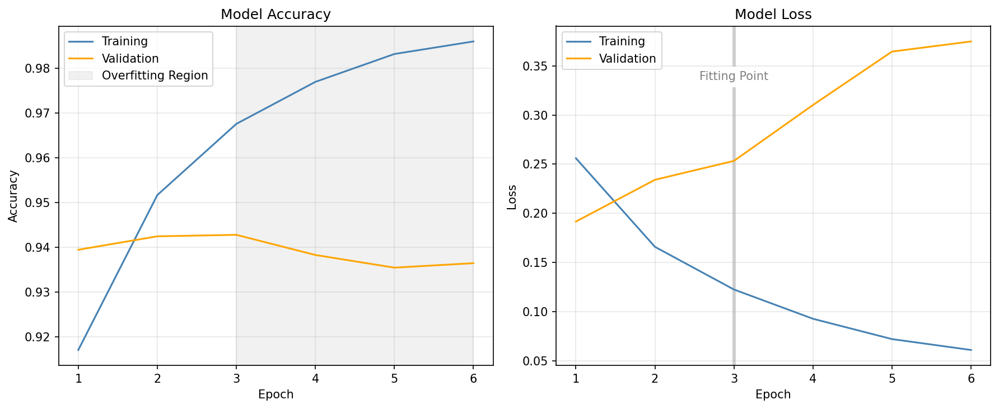

# CURB: A Refined BERT Implementation for Sequence Classification using PyTorch & HuggingFace

*Classification Using Refined BERT* — a fine-tuned BERT model for news article 
classification, served via a FastAPI backend. Categorizes text into **World**, 
**Sports**, **Business**, and **Science/Technology** with ~94% accuracy on 
the AG News dataset.


## Demo

```bash
# Classify a news article
curl -X POST http://localhost:8000/predict \
  -H "Content-Type: application/json" \
  -d '{"text": "The stock market surged today as investors reacted to stronger than expected earnings reports from major tech companies."}'
```

```json
{
  "text": "The stock market surged today as investors reacted to stronger than expected earnings reports from m...",
  "category": "Business",
  "confidence": 0.9852,
  "all_probabilities": {
    "World": 0.0002,
    "Sports": 5.44e-05,
    "Business": 0.9852,
    "Science": 0.0144
  },
  "processing_time": 0.1057
}
```


## Tech Stack

- **Model**: BERT (bert-base-cased) fine-tuned for news classification
- **Backend**: FastAPI with async support
- **ML Framework**: PyTorch + HuggingFace Transformers
- **Dataset**: [AG News](https://www.kaggle.com/datasets/amananandrai/ag-news-classification-dataset)


## Quick Start

### Prerequisites

- Python 3.10+
- CUDA-compatible GPU (recommended) or CPU
- ~1 GB disk space (model weights + dependencies)

### Install

```bash
git clone https://github.com/prestonhemmy/CURB.git
cd CURB
python -m venv .venv
source .venv\Scripts\activate  # macOS/Linux: .venv/bin/activate
pip install -r requirements.txt
```

### Train

A pre-trained checkpoint is not included due to file size. Train the model to 
generate one:

```bash
python -m src.train
```

This saves the checkpoint to `models/checkpoints/best_model_state.pt`. Training 
takes ~3-4 hours on an NVIDIA RTX 4050 GPU.


### Run

```bash
# Development (with hot reload)
uvicorn app.main:app --reload

# Or use the provided scripts
./run_dev.sh   # development with reload
./run_prod.sh  # production with 4 workers
```

The API is available at `http://localhost:8000` with interactive docs at
[`/docs`](http://localhost:8000/docs).

### Test

```bash
# Health check
curl http://localhost:8000/health

# Classify text
curl -X POST http://localhost:8000/predict \
  -H "Content-Type: application/json" \
  -d '{"text": "The stock market surged today as investors reacted to strong earnings."}'

# Run test suite
pytest tests/
```


## Architecture

```
Input Text → BERT Tokenizer → Fine-tuned BERT → Softmax → Category + Confidence
```

```
CURB/
├── app/
│   ├── main.py                # FastAPI endpoints and lifespan
│   └── static/
│       └── index.html         # Web interface (planned)
├── src/
│   ├── config.py              # Hyperparameters and paths
│   ├── model.py               # BERT + classification head
│   ├── data_loader.py         # AG News data pipeline
│   ├── train.py               # Training loop with early stopping
│   ├── predict.py             # Inference service (singleton)
│   └── utils.py               # Helpers
├── notebooks/
│   ├── 01_data_exploration.ipynb
│   ├── 02_bert_tutorial.ipynb
│   └── 03_model_evaluation.ipynb
├── models/
│   └── checkpoints/           # Saved model weights (.gitignored)
└── data/
    └── raw/                   # AG News CSVs (.gitignored)
```


## API Endpoints

| Endpoint   | Method | Description                           |
|------------|--------|---------------------------------------|
| `/`        | GET    | API status and model info             |
| `/health`  | GET    | Model diagnostics (load time, errors) |
| `/predict` | POST   | Classify news text                    |
| `/docs`    | GET    | Interactive Swagger documentation     |

<!-- TODO: Add batch endpoint row once implemented -->
<!-- | `/predict-batch` | POST | Classify up to 10 articles | -->


## Performance

Evaluated on the AG News test set (7,600 articles).

---

<div align="center">
    
</div>

---

<table>
<tr><th>Model Metrics</th>
<th>&nbsp;&nbsp;&nbsp;&nbsp;&nbsp;&nbsp;&nbsp;&nbsp;&nbsp;&nbsp;&nbsp;&nbsp;</th>
<th>Per-Class Results</th></tr>
<tr><td>

| Metric         | Score  |
|----------------|--------|
| Accuracy       | 94.0%  |
| Macro F1       | 0.94   |
| Inference Time | ~105ms |
| Model Size     | 413 MB |

</td><td>
</td><td>

| Category | Precision | Recall | F1   |
|----------|-----------|--------|------|
| World    | 0.94      | 0.96   | 0.95 |
| Sports   | 0.99      | 0.97   | 0.98 |
| Business | 0.92      | 0.88   | 0.90 |
| Science  | 0.90      | 0.93   | 0.91 |

</td></tr> </table>


## Training Details

- **Epochs**: 10 (with early stopping, patience 3)
- **Batch Size**: 16
- **Max Sequence Length**: 150 tokens
- **Optimizer**: AdamW (lr = 2e-5)
- **Scheduler**: Linear warmup
- **Hardware**: NVIDIA GeForce RTX 4050 (6 GB VRAM)

---



---

### Evaluation

```bash
# Per-class metrics + confusion matrix
python -m src.evaluate

# Generate training curves
python -m src.plot_training
```


## Author

**Preston Hemmy**

GitHub: [@prestonhemmy](https://github.com/prestonhemmy)

LinkedIn: [Preston Hemmy](https://linkedin.com/in/prestonhemmy)
